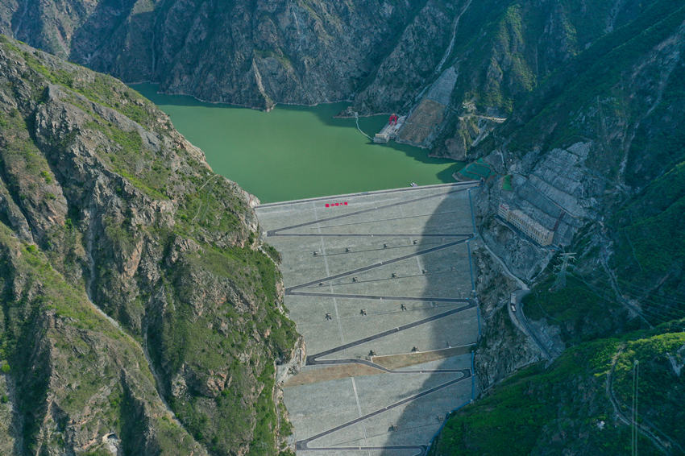

# Shouwei Gao's GitHub Profile 👋

Hi, there! Welcome to my GitHub profile! I am a **Doctoral Student in Computer Science** at **Oregon State University** with a strong interest in **AI for Science, Model Compression, and Efficient AI, and Machine Learning Systems**.

<!-- ## [CV](./CV%2012152024.pdf) -->
## News
- 2025/09/08: I am currently working as an intern at Oak Ridge National Laboratory. My work is mainly about the large scale LLM deployment on GPU cluster.
- 2025/03/31: I had a paper presentation on conference of AAAI 2025 symposium on GenAI@Edge.

## 🎓 Education

- **Doctorate in Computer Science**
  Oregon State University (08/2024–Now)(My boss brought me here)
  Florida International University (08/2023–08/2024)
  *Research Interest:* Efficient AI, AI for Science, Model Compression, Explainable AI.

- **Master of Engineering in Electronic Information**  
  University of Electronic Science and Technology of China (09/2020–06/2023)  
  <!-- *Thesis:* Research on Eddy Current Array Defect Detection Algorithm Based on Deep Learning. -->

- **Bachelor of Science in Energy and Power Engineering**  
  Xi Hua University (09/2014–06/2018)

## Skills and Familar tools
- **Programming Languages:** Python, C/C++, MATLAB.
- **Tools:** Pytorch, Tensorflow, Nsight system, Nsight compute, cuda programming, etc.

<!-- ## 🔥 Ongoing Projects
- **Mitigating the Memory Peak Bottleneck in Scientific Foundation Models**
  - We have proposed a method to alleviate the memory peak bottleneck encountered in scientific foundation models. Our approach is grounded in the computation graph paradigm, where we identify and eliminate unused nodes and edges. Furthermore, we employ a pipeline strategy to efficiently execute large operators.

- **Self-Guided Pruning and Feature Selection for Scientific AI Models**
  - We proposed an end-to-end, self-guided, and user-friendly framework for efficient feature selection and model compression. The proposed method is structured pruning, which enables model speedup and accuracy enhancement. (*Paper under review(IPDPS 2025)*) -->

Teaching Assistant:
- CSC 599: Advanced Topics in Deep Learning & High-performance Computing
- CSC 381: Programming Languages

## 💼 Work Experience
- **Automation Equipment Maintenance Engineer**  
  Sichuan Datang International Ganzi Hydropower Development Co., Ltd. (07/2018–08/2019)
  This is an interesting experience for me, I was working in a beautiful place in west of Sichuan Province, China. The job is about the maintenance of the equipment in the hydropower station. 
  

  
  

<!-- ## 🏆 Achievements
- **2022 Huawei Software Elite Challenge** – Second Prize (7th/611)  
- **2022 Huawei Embedded Software Contest** – 8th/48  
- **2022 ZTE Software Elite Challenge** – Image Denoising Algorithm Contest -->

---

📫 **Contact:**  
- **Email:** [gaosho@oregonstate.edu](mailto:shwgao23@gmail.com)  

Thank you for visiting my profile! Feel free to explore my repositories and collaborate on exciting projects.

<!--
**shwgao/shwgao** is a ✨ _special_ ✨ repository because its `README.md` (this file) appears on your GitHub profile.

Here are some ideas to get you started:

- 🔭 I’m currently working on ...
- 🌱 I’m currently learning ...
- 👯 I’m looking to collaborate on ...
- 🤔 I’m looking for help with ...
- 💬 Ask me about ...
- 📫 How to reach me: ...
- 😄 Pronouns: ...
- ⚡ Fun fact: ...
-->
